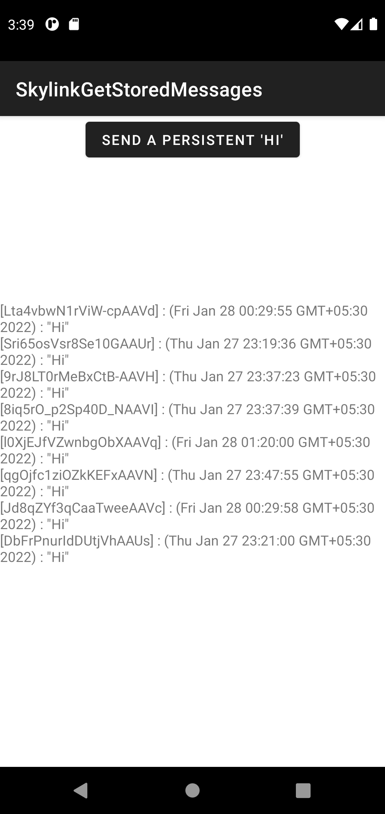

# Skylink Android SDK - `getStoredMessages` API

### How to use `getStoredMessages` API

This is the call flow to get stored messages just after connected to a Skylink room.


1. Initialize a Skylink connection when app starts.

``` java
// Create an Skylink connection instance
SkylinkConnection mSkylinkConnection = SkylinkConnection.getInstance();

// Prepare Skylink Config for messaging
SkylinkConfig skylinkConfig = new SkylinkConfig();
skylinkConfig.setP2PMessaging(true); // Enable messaging
skylinkConfig.setTimeout(SkylinkConfig.SkylinkAction.GET_MESSAGE_STORED,
                         5000); // Set a timeout for getting stored messages
...

// Init Skylink connection
mSkylinkConnection.init(skylinkConfig, getApplicationContext(), new SkylinkCallback() {
    @Override
    public void onError(SkylinkError skylinkError, HashMap<String, Object> hashMap) {
        // Handle Skylink connection init error
    }
});

// Set Skylink connection listeners
mSkylinkConnection.setLifeCycleListener(...);
mSkylinkConnection.setRemotePeerListener(...);
mSkylinkConnection.setMessagesListener(...);
```

2. Connect to a Skylink room when app comes to foreground.

``` java
// Connect to Skylink room
mSkylinkConnection.connectToRoom("Skylink Key ID comes here",
        "Skylink Key secret comes here",
        "Room name comes here",
        "Username of connecting peer comes here",
        new SkylinkCallback() {
            @Override
            public void onError(SkylinkError skylinkError, HashMap<String, Object> hashMap) {
                // Handle Skylink room connection error
            }
        });

ExecutorService mWorkerThreadPool = Executors.newFixedThreadPool(3); // Thread pool to run background tasks
Handler mMainThreadHandler = new Handler(getMainLooper()); // Handler used to post tasks to the main/UI thread from worker threads

// Run background task to wait for Skylink room connection and then get stored messages
mWorkerThreadPool.execute(() -> {
    // Wait until connected to Skylink room
    while(mSkylinkConnection.getSkylinkState() != SkylinkConnection.SkylinkState.CONNECTED) {
        Thread.sleep(500);
    }
    
    // After connected to Skylink room, get stored messages via Skylink connection (runs on main thread)
    mMainThreadHandler.post(() -> {
        // Before get stored messages, set message encrypt secrets to Skylink connection
        Map<String, String> msgEncryptSecrets = new HashMap<>();
        msgEncryptSecrets.put("key1", "Message encrypt secret comes here");
        ...
        mSkylinkConnection.setEncryptSecretsMap(msgEncryptSecrets);

        // Request to get stored messages
        mSkylinkConnection.getStoredMessages(new SkylinkCallback.StoredMessages() {
            @Override
            public void onObtainStoredMessages(JSONArray jsonArray, Map<SkylinkError, JSONArray> errors) {
                if (jsonArray == null && errors == null) {
                    // No stored messages yet
                    return;
                }

                // Has stored message errors?
                if (errors != null) {
                    // Handle errors related to stored messages
                }

                // Has stored message?
                if (jsonArray != null) {
                    // Process retrieved persistent messages
                    // and get each message's sender, content and timestamp
                    for (int i = 0; i < jsonArray.length(); i++) {
                        JSONObject msg = null;
                        String senderId = "Unknown", msgContent = "Unknown";
                        Date timestamp = null;

                        Object msgObj = null;
                        msgObj = jsonArray.get(i);

                        if (msgObj instanceof JSONArray) {
                            msg = ((JSONArray) msgObj).getJSONObject(0);
                        } else if (msgObj instanceof JSONObject) {
                            msg = (JSONObject) msgObj;
                        } else {
                            continue;
                        }

                        senderId = msg.getString("senderId");
                        msgContent = msg.getString("data");
                        String timestampStr = msg.getString("timeStamp");
                        timestamp = new Date(Long.parseLong(timestampStr));
                    }
                }
            }
        });
    });
});
```

3. Disconnect from Skylink room when app goes to background.

``` java
mSkylinkConnection.disconnectFromRoom(new SkylinkCallback() {
    @Override
    public void onError(SkylinkError skylinkError, HashMap<String, Object> hashMap) {
        Log.e(TAG, "Failed to disconnect from Skylink room. " +
                skylinkError.getDescription() + " " + hashMap.get(SkylinkEvent.CONTEXT_DESCRIPTION));
    }
});
```

4. Release Skylink connection when app exists.

``` java
// Stop all background tasks immediately
mWorkerThreadPool.shutdownNow();

// Clear Skylink connection
mSkylinkConnection.clearInstance();
mSkylinkConnection = null;
```

## Sample app

This repository contains an Android Studio (2020.3.1 Patch 4) project of a simple app that demonstrate how to accurately invoke `getStoredMessages` API.

Before building and running app, please set your Skylink Key ID and secret in `app/src/main/res/values/skylink_config.xml`.

And enable Persistent messaging for your Skylink Key in Temasys Console.

``` xml
<?xml version="1.0" encoding="utf-8"?>
<resources>
    <string name="skylink_key_id">Your Skylink Key ID should come here</string>
    <string name="skylink_key_secret">Your Skylink Key secret should come here</string>
    ...
</resources>
```

A screenshot of running app.

